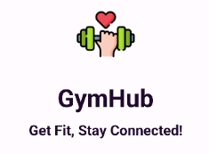

# GymHub

  

Integrating fitness into your life has never been easier. GymHub, your ultimate fitness companion, empowers you to maximize your gym experience. Benefit from real-time gym traffic updates, effortless workout logging, and a vibrant fitness community. Schedule workout classes, invite friends to join you, or even share your latest workout. GymHub has it all. Discover a new way to stay motivated, connect with like-minded fitness enthusiasts, and get the most out of your gym membership - all in one app.

### Features
-	Scan in to your gym
-	See schedule of the week’s available classes
-	Register for classes
-	See your daily workout plan
-	Track workouts and see workout history
-	Follow other gym goers and see their working out status
-	Use communication forums to connect with fellow gym goers
-	Comment and like other user’s posts

### Contributors

**Zixi Li**

**GitHub:** christinalizx

**Email:** li.zixi1@northeastern.edu

Responsible for building up workout page, schedule timetable, registering for classes, homepage layout and gym traffic display.
_____________________________
**Marian Padron**

**GitHub:** mpadron-neu

**Email:** padrongil.m@northeastern.edu

Contributed to functionalities such as registering a new user, scanning in to gym, connecting with other users and being able to see their current workout status and information, as well as user profile editing, updating, and logging out.
______________________________

**Kirby Jiang**

**GitHub:** jiangkirby

**Email:** jiang.ki@northeastern.edu

Collaborated by helping implement functionalities such as being able to follow other users and render them to the app, correct fetching and handling of working out data, as well as aided in bug prevention and resolution.
___________________________

**Ziyi Li**

**GitHub:** ziyilll

**Email:** li.ziyi6@northeastern.edu

Responsible for building the forum part of the gym hub app, including writing and publishing posts, making comments, like, views and so on.
